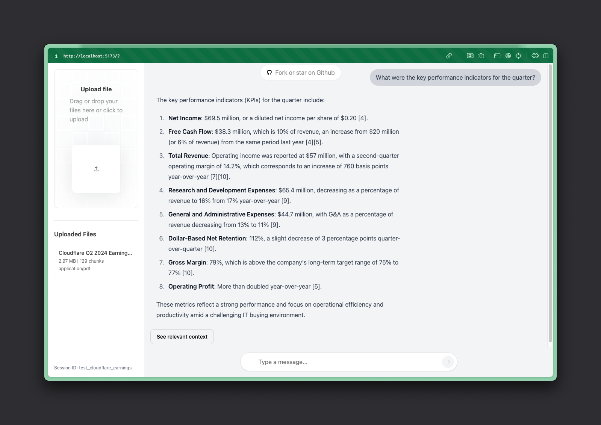

# Fullstack Cloudflare RAG

> This is a fullstack example of how to build a RAG (Retrieval Augmented Generation) app with Cloudflare. It uses Cloudflare Workers, Pages, D1, R2, and AI SDK.

[](./assets/cloudflare_rag_demo.mp4)

## Development

Install dependencies:

```sh
pnpm install # or npm install
```

Deploy necessary primitives:

```sh
./setup.sh
```

Then, create a `.dev.vars` file with your API keys:

```sh
CLOUDFLARE_ACCOUNT_ID=your-cloudflare-account-id # Required
GROQ_API_KEY=your-groq-api-key # Optional
OPENAI_API_KEY=your-openai-api-key # Optional
ANTHROPIC_API_KEY=your-anthropic-api-key # Optional
```

If you don't have these keys, `/api/stream` will fallback to [Workers AI](https://developers.cloudflare.com/workers-ai/).

Run the dev server:

```sh
npm run dev
```

And access the app at `http://localhost:5173/`.

## Deployment

Having the necessary primitives setup, first setup secrets:

```sh
npx wrangler secret put CLOUDFLARE_ACCOUNT_ID
npx wrangler secret put GROQ_API_KEY
npx wrangler secret put OPENAI_API_KEY
npx wrangler secret put ANTHROPIC_API_KEY
```

Then, deploy your app to Cloudflare Pages:

```sh
npm run deploy
```
