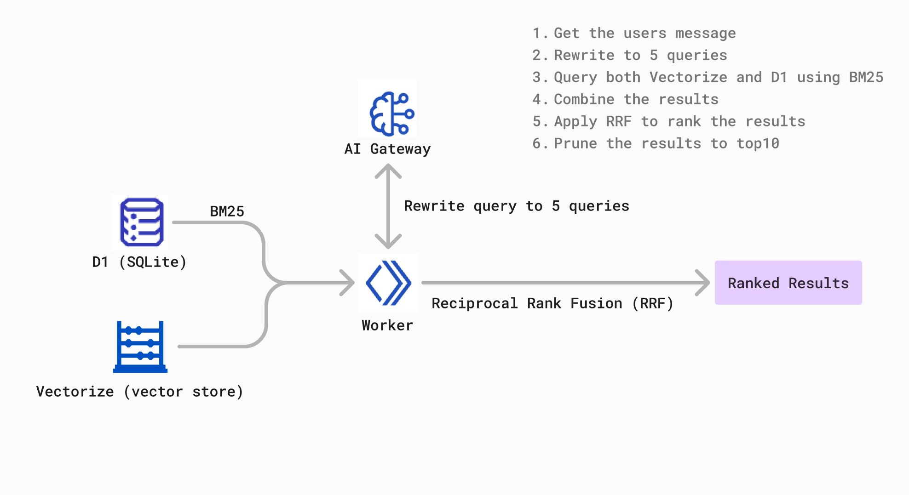

# Fullstack Cloudflare RAG

> This is a fullstack example of how to build a RAG (Retrieval Augmented Generation) app with Cloudflare. It uses Cloudflare Workers, Pages, D1, KV, R2, AI Gateway and Workers AI.

https://github.com/user-attachments/assets/cbaa0380-7ad6-448d-ad44-e83772a9cf3f

[Demo](https://cloudflare-rag.pages.dev/)

[](https://deploy.workers.cloudflare.com/?url=https://github.com/RafalWilinski/cloudflare-rag)

Features:

- Every interaction is streamed to the UI using [Server-Sent Events](https://developer.mozilla.org/en-US/docs/Web/API/Server-sent_events)
- Hybrid RAG using Full-Text Search on [D1](https://developers.cloudflare.com/d1/) and Vector Search on [Vectorize](https://developers.cloudflare.com/vectorize/) 
- Switchable between various providers (OpenAI, Groq, Anthropic) using [AI Gateway](https://developers.cloudflare.com/ai-gateway/) with fallbacks
- Per-IP Rate limiting using Cloudflare's [KV](https://developers.cloudflare.com/kv/)
- OCR is running inside Cloudflare Worker using [unpdf](https://github.com/unjs/unpdf)
- Smart Placement automatically places your workloads in an optimal location that minimizes latency and speeds up your applications


## Development

> Make sure you have Node, pnpm and wrangler CLI installed.

Install dependencies:

```sh
pnpm install # or npm install
```

Deploy necessary primitives:

```sh
./setup.sh
```

Then, in `wrangler.toml`, set the `d1_databases.database_id` to your D1 database id and `kv_namespaces.rate_limiter` to your rate limiter KV namespace id.

Then, create a `.dev.vars` file with your API keys:

```sh
CLOUDFLARE_ACCOUNT_ID=your-cloudflare-account-id # Required
GROQ_API_KEY=your-groq-api-key # Optional
OPENAI_API_KEY=your-openai-api-key # Optional
ANTHROPIC_API_KEY=your-anthropic-api-key # Optional
```

If you don't have these keys, `/api/stream` will fallback to [Workers AI](https://developers.cloudflare.com/workers-ai/).

Run the dev server:

```sh
npm run dev
```

And access the app at `http://localhost:5173/`.

## Deployment

Having the necessary primitives setup, first setup secrets:

```sh
npx wrangler secret put CLOUDFLARE_ACCOUNT_ID
npx wrangler secret put GROQ_API_KEY
npx wrangler secret put OPENAI_API_KEY
npx wrangler secret put ANTHROPIC_API_KEY
```

Then, deploy your app to Cloudflare Pages:

```sh
npm run deploy
```

## Hybrid Search RAG



This project uses a combination of classical Full Text Search (sparse) against Cloudflare D1 and Hybrid Search with embeddings against Vectorize (dense) to provide the best of both worlds providing the most applicable context to the LLM.

The way it works is this:
1. We take user input and we rewrite it to 5 different queries using an LLM
2. We run each of these queries against our both datastores - D1 database using BM25 for full-text search and Vectorize for dense retrieval
3. We take the results from both datastores and we merge them together using [Reciprocal Rank Fusion](https://www.elastic.co/guide/en/elasticsearch/reference/current/rrf.html) which provides us with a single list of results
4. We then take the top 10 results from this list and we pass them to the LLM to generate a response


## License

This project is licensed under the terms of the MIT License.

## Consulting

If you need help in building AI applications, please reach out to me on [Twitter](https://twitter.com/rafalwilinski) or via my [website](https://rwilinski.ai/). Happy to help!
